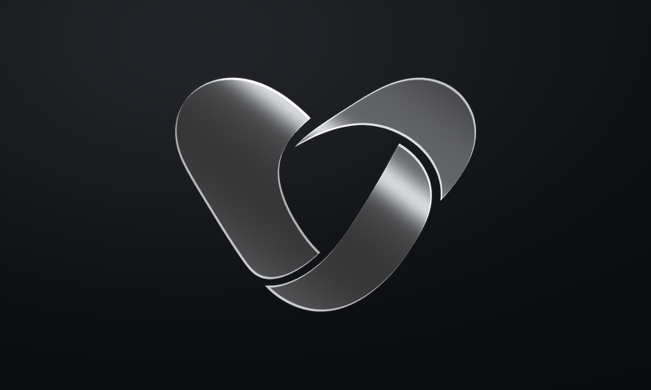

  

<strong>Vivid</strong>

<h1 align="center">Branding</h1>

One mark for light and dark backgrounds.

<a href="../../README.md">Home</a> · <a href="../README.md">Documentation</a> · <a href="../../CONTRIBUTING.md">Contributing</a> · <a href="https://github.com/blurbery/vivid/releases">Releases</a>

---

The app name is **Vivid**. Keep the public byline in the root README only. Use the GitHub username **blurbery** for the maintainer in documentation, contribution rules and approval requests. The logo remains a symbol without text.

Vivid's symbol uses interlocking ribbons to suggest motion and an abstract V. The mark contains no wordmark or lettering.

## Main logo

The transparent silver mark is Vivid’s main logo. It uses the website’s fixed silver lighting on the approved ribbon shape. Use it on both light and dark backgrounds, without adding a background box. The root README, documentation headers and website logos use this finish in both light and dark themes.

<table width="100%">
  <thead>
    <tr><th align="left">Appearance</th><th align="left" width="10000">Asset</th><th align="left">Colour</th></tr>
  </thead>
  <tbody>
    <tr><td>Main logo, either theme</td><td><a href="vivid-mark-silver.png">Transparent silver PNG</a></td><td>Silver</td></tr>
    <tr><td>Website favicon</td><td><a href="../../website/public/favicon.png">Rounded 512 × 512 PNG</a> and <a href="../../website/public/favicon.ico">16–64 px ICO fallback</a></td><td>Silver on graphite gradient</td></tr>
    <tr><td>Safari favourites</td><td><a href="../../website/public/apple-touch-icon.png">Opaque 512 × 512 PNG</a></td><td>Silver on graphite gradient</td></tr>
    <tr><td>Original source artwork</td><td><a href="vivid-mark.png">Transparent PNG</a></td><td>Charcoal</td></tr>
    <tr><td>Legacy dark-theme wrapper</td><td><a href="vivid-mark-dark.svg">Transparent SVG wrapper</a></td><td>Soft white, <code>#E9E9ED</code></td></tr>
  </tbody>
</table>

The silver PNG is a static export of the website’s silver rendering, with clean transparent edges. The charcoal PNG remains the original artwork and the website animation’s source mask. The retained soft-white SVG embeds that original PNG and applies a colour filter; it is a raster-backed display asset, not a traced vector master. Documentation headers use the silver PNG rather than these older variants.

The website’s main and lower logos sample the original artwork at higher display resolution with four-sample edge smoothing. The silver lighting, layout and star-assembly motion stay the same. The favicon and Safari favourites use the approved iOS app artwork. Safari favourites retain the silver V on an opaque, subtle graphite gradient. The tab favicon uses the owner-approved brighter finish with rounded corners and transparency outside the rounded square. The brighter finish avoided Safari’s pale contrast outline in local tab comparisons; the darker original triggered it. Both 512 × 512 PNGs and every ICO size are resampled directly from the 1024 × 1024 app icon with Lanczos filtering. Every page links the favicon and Apple touch icon. Linked icon filenames include a content hash so changed artwork gets a new path, rather than only a query-string version. The build retains the standard root icon URLs for browser fallback requests. Safari may still retain an existing saved icon in its own cache; deployment verification does not confirm that a particular Safari profile has refreshed it.

Preserve the aspect ratio and the clear space already included in the square canvas. Do not add text inside the symbol, stretch it or add shadows. The silver logo does not need a theme switch.

## iOS and Apple TV app icons

Both app targets already include the silver V as their app icon. The source assets below are the ones selected by `ASSETCATALOG_COMPILER_APPICON_NAME` in [the XcodeGen project](../../iosApp/project.yml): `AppIcon` for Vivid on iPhone and iPad, and `TVAppIcon` for VividTV.

<table width="100%">
  <thead><tr><th align="left">iPhone and iPad</th><th align="left" width="10000">Apple TV</th></tr></thead>
  <tbody><tr>
    <td></td>
    <td></td>
  </tr></tbody>
</table>

The iOS icon is one opaque 1024 × 1024 image with a subtle graphite gradient. Apple TV uses the same background finish beneath a separate transparent silver foreground. The broad, restrained lighting adds depth without a border, baked-in corner mask or extra decoration. Each foreground size is resampled directly from the original 1254 × 1254 silver artwork with alpha-aware Lanczos filtering. The Apple TV preview combines the 2× layers; tvOS applies its own focus and parallax effects. Keep those layers separate in the app catalog.

<table width="100%">
  <thead><tr><th align="left">Use</th><th align="left" width="10000">Source assets</th><th align="left">Pixels</th></tr></thead>
  <tbody>
    <tr><td>iOS and iPadOS app icon</td><td><a href="../../iosApp/iosApp/Assets.xcassets/AppIcon.appiconset/AppIcon.png">AppIcon.png</a> · <a href="../../iosApp/iosApp/Assets.xcassets/AppIcon.appiconset/Contents.json">Catalog entry</a></td><td>1024 × 1024</td></tr>
    <tr><td>Apple TV Home screen</td><td><a href="../../iosApp/iosApp/Assets.xcassets/TVAppIcon.brandassets/App%20Icon.imagestack">App Icon layer stack</a></td><td>400 × 240 (1×), 800 × 480 (2×)</td></tr>
    <tr><td>Apple TV App Store</td><td><a href="../../iosApp/iosApp/Assets.xcassets/TVAppIcon.brandassets/App%20Icon%20-%20App%20Store.imagestack">App Store layer stack</a></td><td>1280 × 768</td></tr>
    <tr><td>Apple TV Top Shelf</td><td><a href="../../iosApp/iosApp/Assets.xcassets/TVAppIcon.brandassets/Top%20Shelf%20Image.imageset">Standard images</a> · <a href="../../iosApp/iosApp/Assets.xcassets/TVAppIcon.brandassets/Top%20Shelf%20Image%20Wide.imageset">Wide images</a></td><td>1920 × 720 or 2320 × 720, plus 2× versions</td></tr>
  </tbody>
</table>

These source catalogs supply the app icons in new builds. The graphite finish updates the existing icons; installing a new build is required to see it. Updating these assets does not publish an App Store build. Website icons reuse this graphite artwork; documentation marks retain their transparent backgrounds.

The graphite icon assets passed Apple asset-catalog compilation for iOS 18.0 and tvOS 26.0. Image checks confirmed opaque backgrounds, transparent antialiased foregrounds and valid catalog references. The icons are included in the installed iPhone and Apple TV test builds. A separate check of every icon presentation, including physical iPad and Apple TV focus/parallax, is not recorded.

Apple TV setup and login use `VividMarkSilver`, downsampled to physical display pixels by `VividLogoView` to preserve clean small edges. The original silhouette is retained in `VividMarkSource` for the star-assembly animation. `VividStartupView` renders the star-to-ribbon sequence on black, with Reduce Motion and a static-mark fallback. Apple TV Top Shelf artwork uses Vivid on a dark background. Home and the other root tab pages intentionally omit a separate top-left logo.

Provider selection uses the Silo, Emby and Jellyfin logos to identify the supported server types. Vivid keeps its own app icon, startup artwork and branding. Silo and Emby cards open native setup on mobile and Apple TV. Jellyfin remains Coming Soon. App Store submission remains a separate integration step.

## Asset provenance

Created with the built-in image-generation tool and selected by the project owner. The final extraction prompt asked for the exact approved interlocking ribbon symbol, centred on a square transparent canvas, in charcoal, with no text, background, shadow or additional elements. The dark-mode presentation uses the same approved alpha silhouette so the mark does not change shape when the theme changes.

Use Vivid's name and logo for the app. Server names identify supported connections. Preserve existing code licences, copyright and dependency notices when updating branding.

## Brand policy

Vivid™ and the ribbon logo are trademarks claimed by blurbery. Forks and other projects must use their own name and artwork unless blurbery gives prior, explicit written consent. This includes the silver mark, animated logo and app icons. See [Vivid’s brand and trademark policy](../../TRADEMARK.md).
